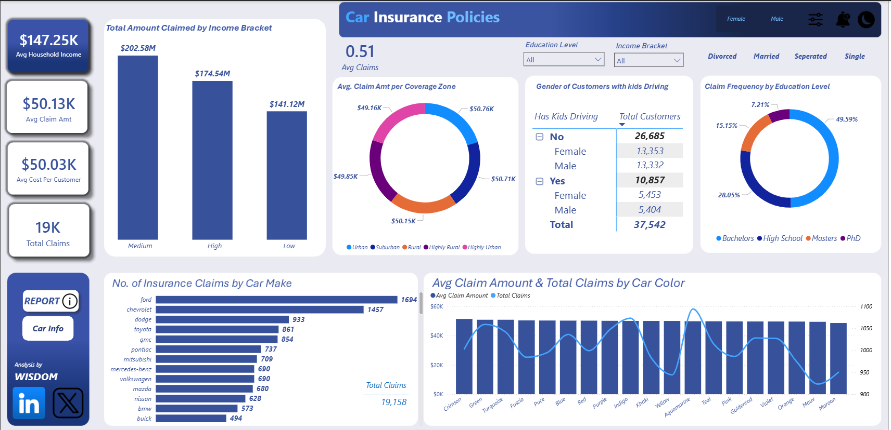
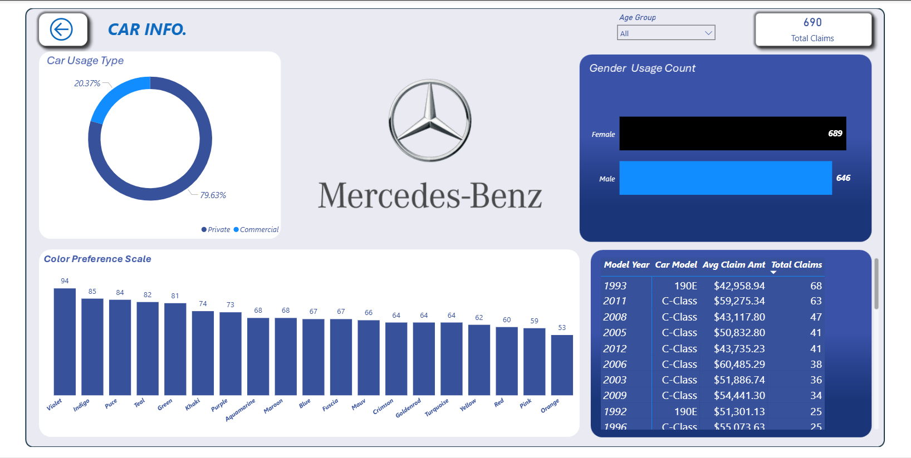
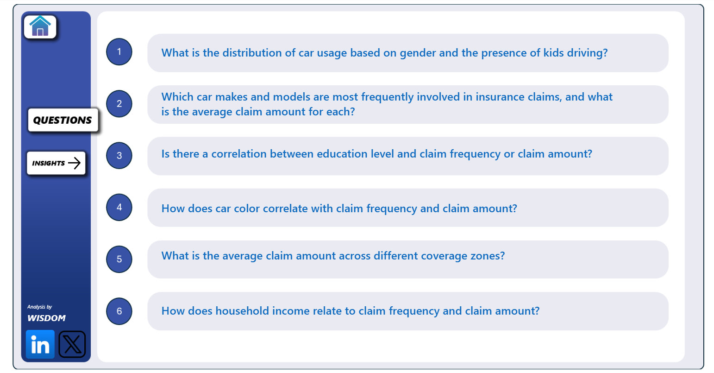
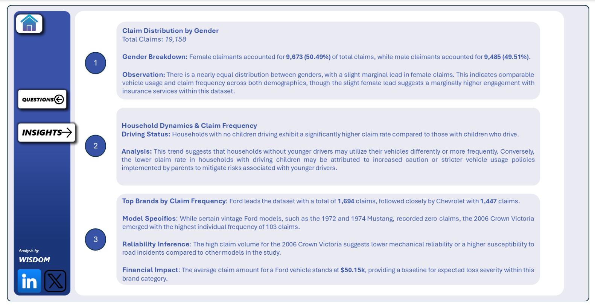
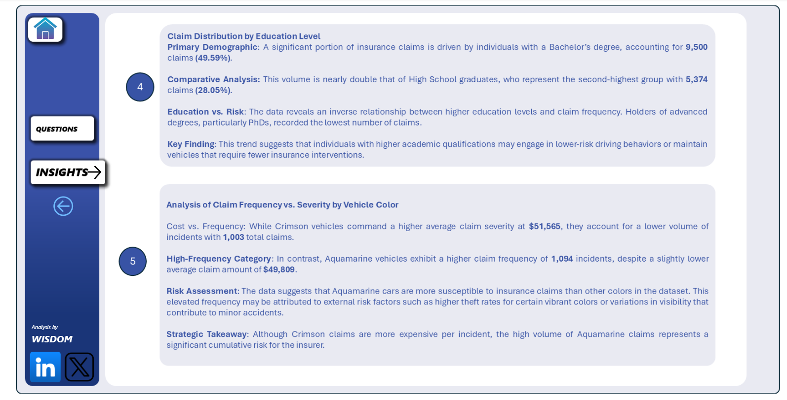
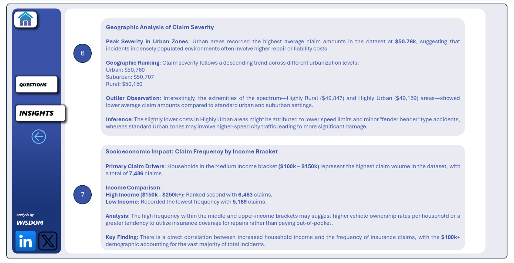

# 🚗 Car Insurance Policies — Interactive Power BI Dashboard

## 📊 Project Overview

This project presents a comprehensive **Car Insurance Claims Analysis** built in **Microsoft Power BI**, exploring policyholder behavior, claim patterns, and risk factors across **37,542 customers** and **19,158 total claims**. The dashboard is fully interactive with slicers for gender, marital status, education level, and income bracket.

🔗 **[👉 Click Here to View the Live Interactive Dashboard](https://rebrand.ly/23oykcb)**

---

## 🖼️ Dashboard Preview

### 📌 Main Dashboard — Overview

---

### 🚘 Car Info Page

---

### 📋 Report — Analytical Questions

---

### 💡 Insights Page 1 — Gender, Household Dynamics & Top Brands

---

### 💡 Insights Page 2 — Education Level & Vehicle Color

---

### 💡 Insights Page 3 — Geographic Severity & Income Bracket

---

## ⚙️ Data Cleaning & Transformation — Power Query (M Language)

Before building the dashboard, the raw dataset was processed and cleaned in **Power Query Editor** within Power BI. The following steps were applied:

### 🧹 Data Cleaning Steps
- **Removed Duplicates** — Ensured each policyholder `ID` was unique with no repeated records.
- **Handled Null / Missing Values** — Identified and addressed blank fields across key columns such as `Claim Amount`, `Education`, `Marital Status`, and `Gender`.
- **Corrected Data Types** — Assigned appropriate data types to all columns:
  - `Birth Date` → Date
  - `Household Income`, `Claim Amount`, `Claim Frequency` → Decimal Number / Whole Number
  - `Car Year` → Whole Number
  - All categorical fields (`Gender`, `Education`, `Car Make`, etc.) → Text
- **Standardized Text Values** — Cleaned inconsistent capitalization and spacing in categorical fields (e.g., `Car Colour`, `Coverage Zone`, `Marital Status`).
- **Created Age Group Column** — Derived a conditional `Age Group` column from the raw `Age` field to enable grouped demographic analysis.
- **Created Income Bracket Column** — Binned raw `Household Income` values into Low, Medium, and High bracket categories for segmentation.
- **Filtered Irrelevant Rows** — Removed any records outside the scope of the analysis.
- **Renamed Columns** — Renamed fields for clarity and consistency across the data model.
- **Trimmed & Cleaned Text** — Applied `Text.Trim` and `Text.Clean` functions to remove leading/trailing spaces and non-printable characters.

---

## 🗂️ Data Model — `Prime` Table

### 📐 Dimension Columns (Categorical / Descriptive)

| Column | Description |
|---|---|
| `ID` | Unique policyholder identifier |
| `Gender` | Customer gender (Male / Female) |
| `Age` / `Age Group` | Customer age and grouped age band |
| `Birth Date` / `Birth Year` | Date of birth fields |
| `Marital Status` | Divorced, Married, Separated, or Single |
| `Education` | Highest education level attained |
| `Has Kids Driving` | Whether children in the household drive (Yes/No) |
| `Number of Kids Driving` | Count of driving-age kids per household |
| `Parent` | Indicates parental status |
| `Income Bracket` | Grouped income band (Low / Medium / High) |
| `Coverage Zone` | Geographic area (Urban, Suburban, Rural, Highly Rural, Highly Urban) |
| `Car Make` | Vehicle manufacturer |
| `Car Model` | Specific vehicle model |
| `Car Year` | Year of vehicle manufacture |
| `Car Colour` | Vehicle color |
| `Car Use` | Usage type — Private (81.24%) or Commercial (18.76%) |
| `Logo URL` | Brand logo used for visual display on Car Info page |

### 📏 Raw Numeric Fields

| Column | Description |
|---|---|
| `Household Income` | Raw household income value per record |
| `Claim Amount` | Raw dollar value of each claim |
| `Claim Frequency` | Number of claims per policyholder |
| `Total Claimed Amount` | Summed claim amount per record |

### 🧮 Calculated Measures (DAX)

| Measure | Description |
|---|---|
| `Avg Claim Amt` | Average claim amount across filtered records |
| `Avg Claims` | Average number of claims per policy |
| `Avg Cost Per Customer` | Average total cost attributed per customer |
| `Avg Household Income` | Average household income across policyholders |
| `Total Claims` | Total count of all insurance claims filed |
| `Total Customers` | Total number of unique policyholders |
| `No. Of People Who Claimed` | Count of customers with at least one claim |
| `No. Of People With Zero Claims` | Count of customers with no recorded claims |

---

## 📌 Overall Key Metrics (All Genders · All Marital Statuses)

| Metric | Value |
|---|---|
| Avg Household Income | $147.25K |
| Avg Claim Amount | $50.13K |
| Avg Cost Per Customer | $50.03K |
| Total Claims | 19,158 |
| Total Customers | 37,542 |
| Avg Claims per Policy | 0.51 |

---

## 🔢 Detailed KPI Breakdown by Gender & Marital Status

### 👩 Female Policyholders (All Marital Statuses)

| Metric | Value |
|---|---|
| Avg Household Income | $147.37K |
| Avg Claim Amount | $50.00K |
| Avg Cost Per Customer | $49.86K |
| Total Claims | 9,673 |
| Total Customers | 18,806 |
| Avg Claims | 0.51 |
| Total Claimed (Medium Income) | $101.97M |
| Total Claimed (High Income) | $87.83M |
| Total Claimed (Low Income) | $71.10M |

### 👨 Male Policyholders (All Marital Statuses)

| Metric | Value |
|---|---|
| Avg Household Income | $147.13K |
| Avg Claim Amount | $50.25K |
| Avg Cost Per Customer | $50.20K |
| Total Claims | 9,485 |
| Total Customers | 18,736 |
| Avg Claims | 0.51 |
| Total Claimed (Medium Income) | $100.60M |
| Total Claimed (High Income) | $86.71M |
| Total Claimed (Low Income) | $70.03M |

---

## 💍 Breakdown by Marital Status

### 💔 Divorced

| Metric | Value |
|---|---|
| Avg Household Income | $146.39K |
| Avg Claim Amount | $49.61K |
| Avg Cost Per Customer | $50.09K |
| Total Claims | 3,129 |
| Total Customers | 6,357 |
| Avg Claims | 0.49 |
| Has Kids Driving — No | 4,561 (Female: 2,282 · Male: 2,279) |
| Has Kids Driving — Yes | 1,796 (Male: 925 · Female: 871) |
| Total Claimed (Medium Income) | $33.08M |
| Total Claimed (High Income) | $28.99M |
| Total Claimed (Low Income) | $23.70M |

### 💑 Married

| Metric | Value |
|---|---|
| Avg Household Income | $147.32K |
| Avg Claim Amount | $50.38K |
| Avg Cost Per Customer | $50.34K |
| Total Claims | 6,540 |
| Total Customers | 12,570 |
| Avg Claims | 0.52 |
| Has Kids Driving — No | 8,968 (Male: 4,511 · Female: 4,457) |
| Has Kids Driving — Yes | 3,602 (Male: 1,826 · Female: 1,776) |
| Total Claimed (Medium Income) | $67.95M |
| Total Claimed (High Income) | $59.11M |
| Total Claimed (Low Income) | $47.97M |

### 💛 Separated

| Metric | Value |
|---|---|
| Avg Household Income | $148.48K |
| Avg Claim Amount | $49.01K |
| Avg Cost Per Customer | $49.26K |
| Total Claims | 1,649 |
| Total Customers | 3,090 |
| Avg Claims | 0.53 |
| Has Kids Driving — No | 2,147 (Female: 1,079 · Male: 1,068) |
| Has Kids Driving — Yes | 943 (Female: 507 · Male: 436) |
| Total Claimed (Medium Income) | $16.32M |
| Total Claimed (High Income) | $14.66M |
| Total Claimed (Low Income) | $12.59M |

### 💍 Single

| Metric | Value |
|---|---|
| Avg Household Income | $147.30K |
| Avg Claim Amount | $50.36K |
| Avg Cost Per Customer | $49.91K |
| Total Claims | 7,840 |
| Total Customers | 15,525 |
| Avg Claims | 0.50 |
| Has Kids Driving — No | 11,009 (Female: 5,535 · Male: 5,474) |
| Has Kids Driving — Yes | 4,516 (Female: 2,299 · Male: 2,217) |
| Total Claimed (Medium Income) | $85.23M |
| Total Claimed (High Income) | $71.78M |
| Total Claimed (Low Income) | $56.87M |

---

## 🔍 Key Insights

### 1. 👥 Claim Distribution by Gender
- Female claimants: **9,673 (50.49%)** | Male claimants: **9,485 (49.51%)**
- Near-equal distribution across genders with a marginal female lead, indicating comparable vehicle usage and insurance engagement across both demographics.

### 2. 💍 Marital Status & Claim Volume
- **Single** policyholders drive the highest claim volume at **7,840 claims** across **15,525 customers**.
- **Married** policyholders follow with **6,540 claims** and the highest avg claims rate of **0.52**.
- **Separated** policyholders recorded the fewest claims (**1,649**) but the **highest avg household income ($148.48K)** and avg claims rate of **0.53**.
- **Divorced** policyholders had the lowest avg claims rate at **0.49**.

### 3. 🏠 Household Dynamics & Claim Frequency
- Across all marital statuses, households **without children driving** consistently show **higher customer counts and claim rates**.
- Households **with kids driving** make up roughly 28–29% of each marital segment, suggesting parents apply stricter vehicle usage caution.

### 4. 🚙 Top Car Makes by Claim Frequency
- **Ford leads** with **1,694 claims**, followed by **Chevrolet (1,457)** and **Dodge (933)**.
- The **2006 Ford Crown Victoria** recorded the highest single model frequency at **103 claims**.
- Average claim amount for Ford: **$50.15K**.

### 5. 🎓 Education Level vs. Claim Frequency
- **Bachelor's degree holders** dominate: **9,500 claims (49.59%)**.
- **High School graduates**: **5,374 claims (28.05%)**.
- **Masters holders**: ~15% | **PhD holders**: ~7% — confirming an **inverse relationship** between education and claim frequency.

### 6. 🎨 Vehicle Color: Frequency vs. Severity
- **Aquamarine** — highest frequency: **1,094 claims** (avg: $49,809) → highest **cumulative risk**.
- **Crimson** — highest severity: **$51,565** per claim (1,003 claims) → highest **per-incident cost**.

### 7. 🗺️ Geographic Claim Severity
- **Urban**: $50,760 (highest) → **Suburban**: $50,707 → **Rural**: $50,150
- **Highly Urban** ($49,159) and **Highly Rural** ($49,847) both lower, likely due to lower-speed minor-impact incidents.

### 8. 💰 Income Bracket Impact
- **Medium income ($100K–$150K)**: **7,486 claims** — highest volume.
- **High income ($150K–$250K+)**: **6,483 claims**.
- **Low income**: **5,189 claims** — lowest volume.
- Strong direct correlation between income level and claim frequency across all marital segments.

---

## 🔎 Analytical Questions Explored

1. What is the distribution of car usage based on gender and the presence of kids driving?
2. Which car makes and models are most frequently involved in insurance claims, and what is the average claim amount for each?
3. Is there a correlation between education level and claim frequency or claim amount?
4. How does car color correlate with claim frequency and claim amount?
5. What is the average claim amount across different coverage zones?
6. How does household income relate to claim frequency and claim amount?

---

## 📋 Dashboard Pages

| Page | Description |
|---|---|
| **Dashboard** | Main KPI overview with gender & marital status slicers |
| **Car Info** | Per-brand deep-dive: color preferences, usage type, model-year stats |
| **Report** | Six analytical questions framing the study |
| **Insights** | Findings 1–3: Gender, Household Dynamics, Top Brands |
| **Insight 2** | Findings 4–5: Education Level & Vehicle Color |
| **Insight 3** | Findings 6–7: Geographic Severity & Income Bracket |

---

## 🛠️ Tools Used

| Tool | Purpose |
|---|---|
| **Microsoft Power BI** | Dashboard design, DAX measures, interactive slicers |
| **Power Query (M Language)** | Data cleaning, transformation & preparation |
| **DAX** | Calculated measures and KPI computations |
| **Data Modelling** | Single-table (`Prime`) schema with relationships |

---

## 👤 Author

**Analysis by WISDOM**
Connect on [LinkedIn](#) | Follow on [X/Twitter](#)

---

> ⭐ *If you find this project insightful, please give it a star and feel free to fork it for your own analysis!*
